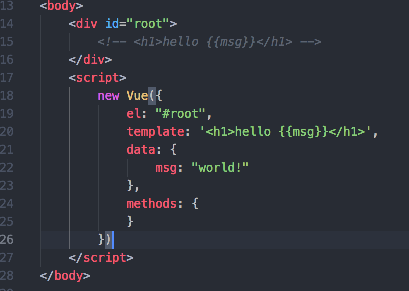
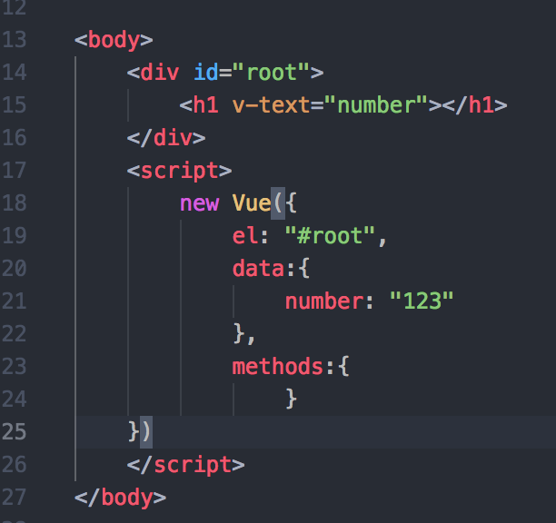
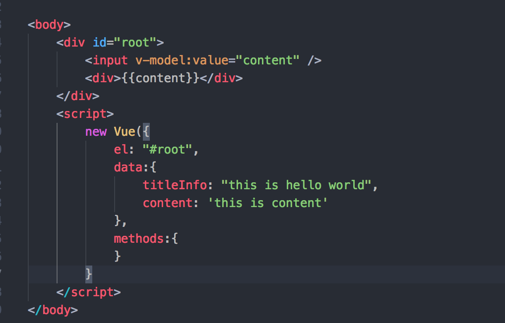

最近在学习 VUE，了解下模板指令 

--不应该使用箭头函数来使用 method-- 

### el 挂载点 

### v-text 

显示内容，v-html 与 v-text 的区别, 

### v-html 

### v-on 

点击事件,可以缩写为 @ 

### 属性绑定&双向数据绑定 

v-bind

简写  : 

####v-model

### v-show&v-for 

显示，v-if是直接隐藏效率较低，v-show是改变css，效率高。 

